FeedUs is a cross-platform, and open-source RSS client.

It is in the early stages of development and anyone is welcome to give suggestions and PR.

FeedUs contains code that is open sourced from [FeedMe](https://github.com/seazon/FeedMe).

## Screenshots
### Android
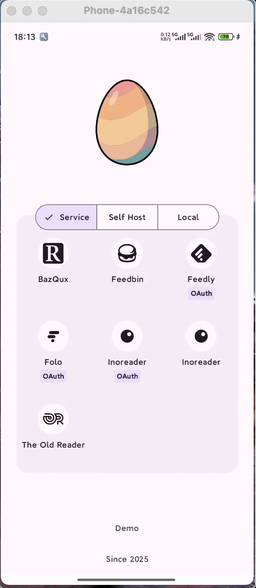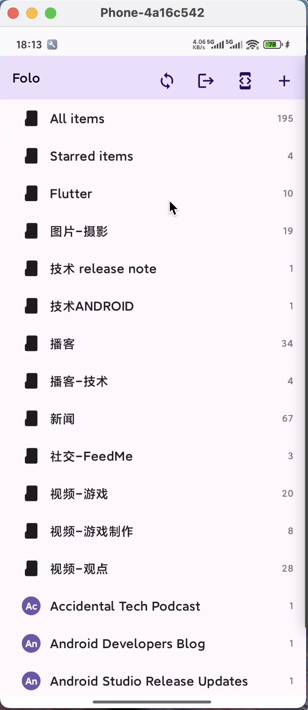

### iOS
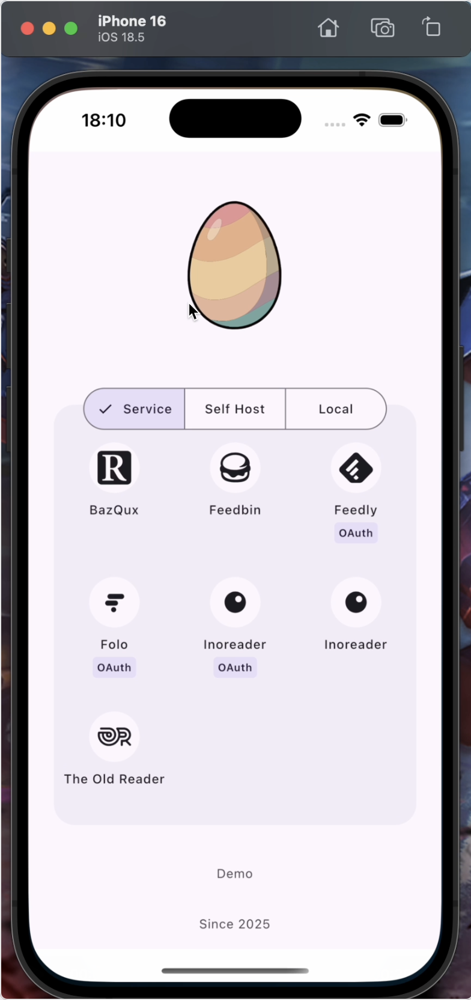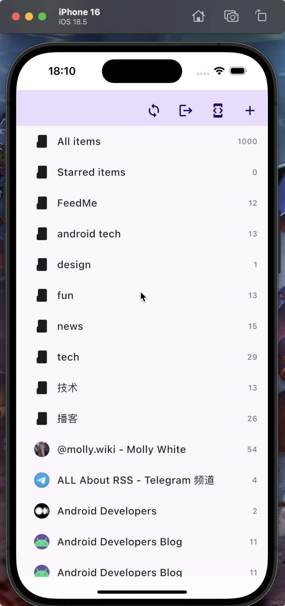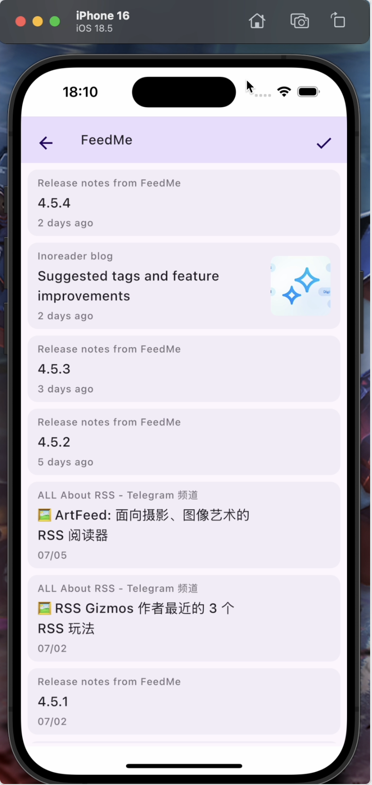

### macOS / Windows / Linux
```
./gradlew clean
./gradlew build
./gradlew run
```
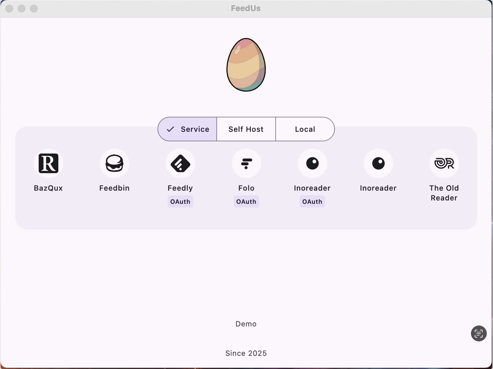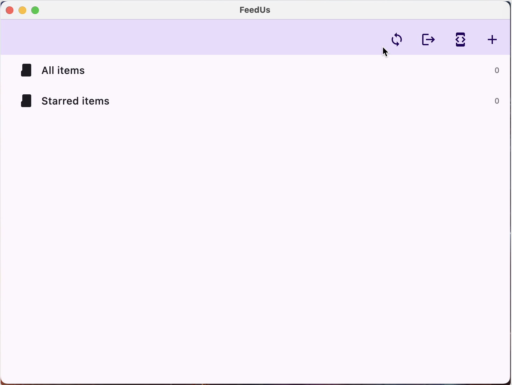

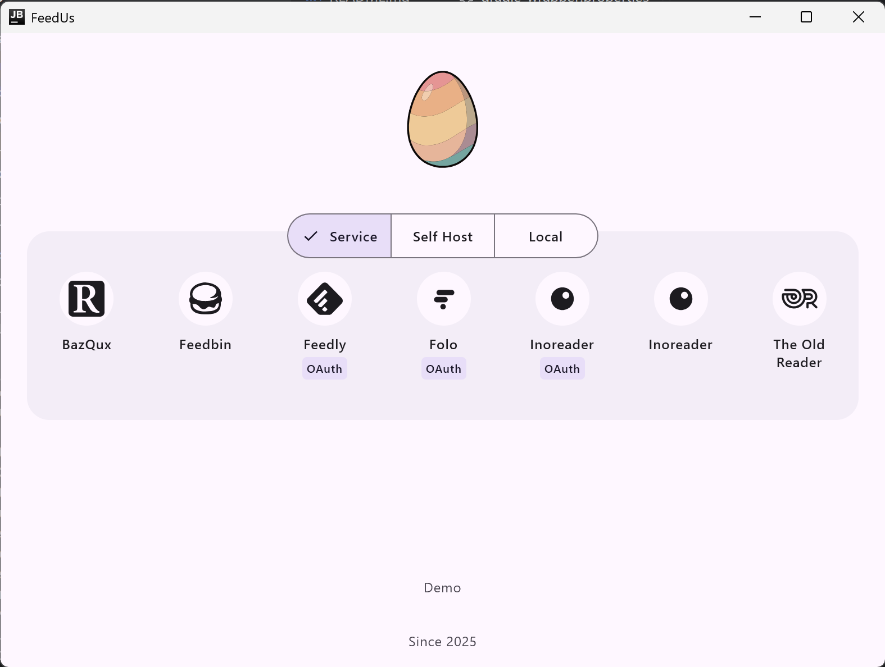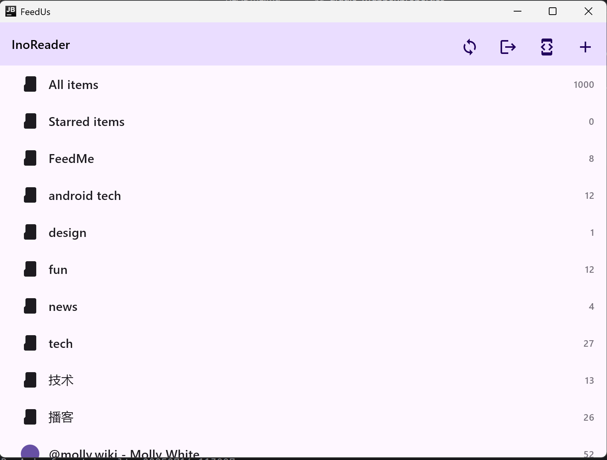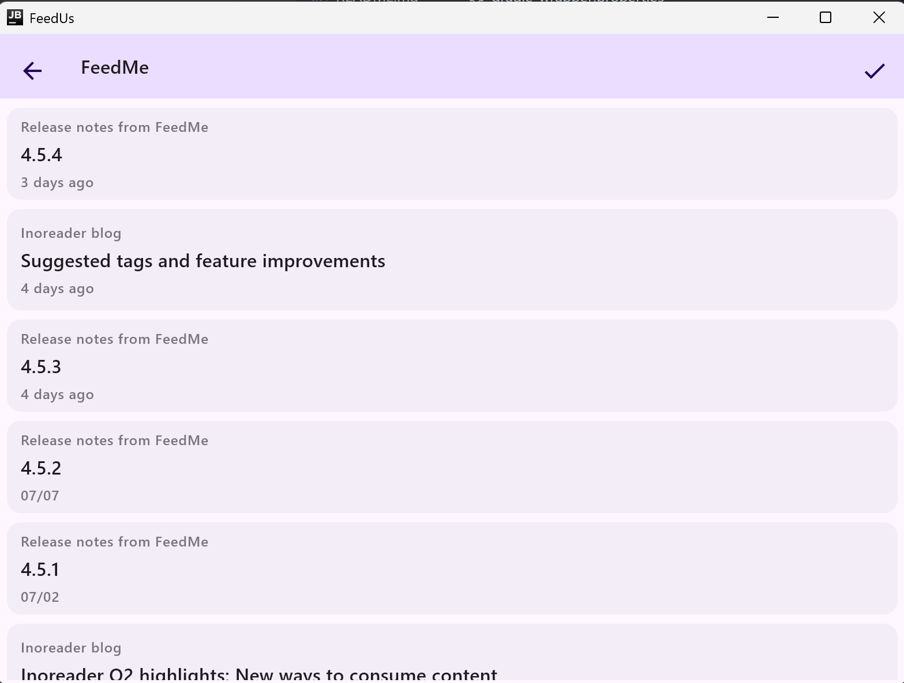

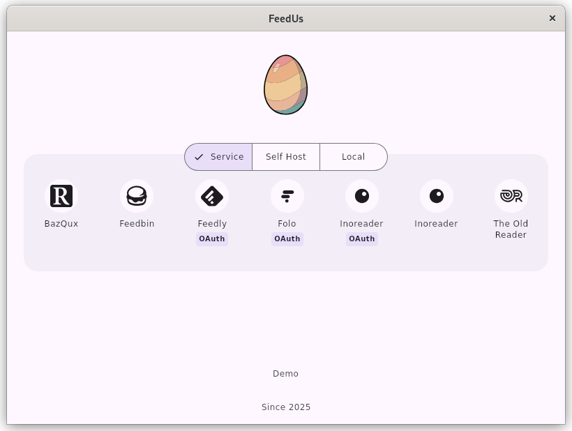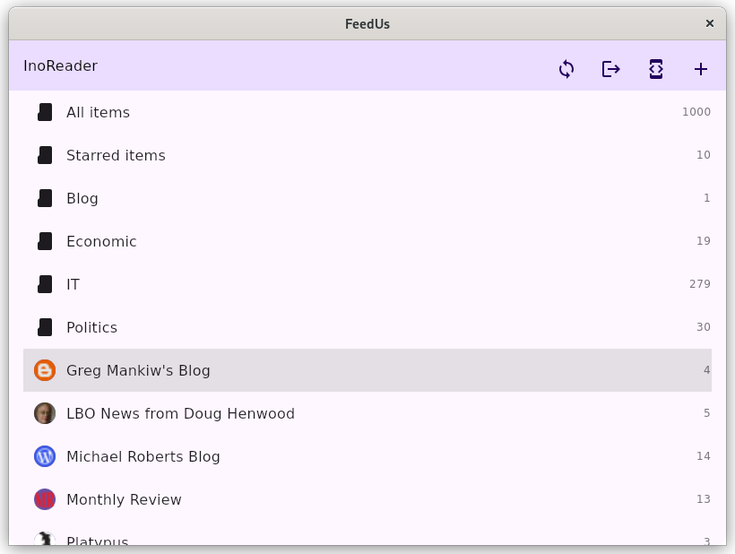

## Progress
| function     | Android | iOS | macOS | Windows | Linux |
|--------------|---------|-----|-------|---------|------|
| normal login | ✅      | ✅  | ✅     | ✅      | ✅    |
| auth login   | ✅      | ❌  | ❌     | ❌      | ❌    |
| sync         | ✅      | ✅  | ✅     | ✅      | ✅    |
| subscribe    | ✅      | ✅  | ✅     | ✅      | ❓    |
| mark read    | ✅      | ✅  | ✅     | ✅      | ❓    |

## API Support
|  | Support Unread Count API | Feed ID Star with ”Feed” | Support Subscribe API | Support Tag API | Support Star API | Support Fetch by Feed / Category | Support Fetch IDs and then Stream | Support pagination | Support podcast |
| --- | --- | --- | --- | --- | --- | --- | --- | --- | --- |
| [Folo](https://api.follow.is/reference) | ✅ | N | ✅ | ❌ | ✅ | ✅ | ❌ | ✅ | ✅ |
| [Fever API](https://blog.badguy.top/index.php/archives/294/) (Miniflux / CommaFeed) | ❌ | N | ❌ | ✅ | ✅ | ❌ | ✅ | ❌ | ❌ |
| Tiny Tiny RSS | ✅ | N | ✅ | ❌ | ✅ | ✅ | ✅ | ✅ | ✅ |
| Feedly | ✅ | Y | ✅ | ✅ | ✅ | ✅ | ✅ | ✅ | ✅ |
| Feedbin | ❌ | N | ✅ | ✅ | ✅ | ❌ | ✅ | ❌ | ❌ |
| Google Reader API ( Inoreader / The Old Reader / FreshRSS / BazQux)| ✅ | Y | ✅ | ✅ | ✅ | ✅ | ✅ | ✅ | ✅ |
